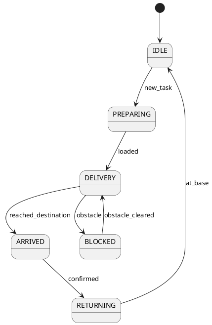

# Relatório de Engenharia Reversa
## Delivery_i18n_amy V5.3.8 (Build 229)

**Data:** 16 de fevereiro de 2026  
**Analista:** Josias Ferreira (Iascom)  
**Arquivo APK:** `Delivery_i18n_amy_V5.3.8(sp1)_229.apk` (141.25 MB)  
**Localização original:** `D:\Projetos\`

---

## 1. VISÃO GERAL DO APLICATIVO

### 1.1 Identificação
- **Pacote Android:** `com.csjbot.diningcar`
- **Nome comercial:** Panda (visível nos assets e strings)
- **Versão:** 5.3.8 (Service Pack 1)
- **Build number:** 229
- **Target SDK:** 29 (Android 10)
- **Arquitetura nativa:** armeabi-v7a
- **Tamanho:** 141.25 MB

### 1.2 Propósito Real do Aplicativo
⚠️ **IMPORTANTE:** Este **NÃO é um aplicativo de delivery para consumidores finais**.

Trata-se de um **sistema de controle embarcado** para robôs autônomos de entrega (CSJBot) utilizados em restaurantes e estabelecimentos comerciais. O robô:
- Navega autonomamente pelo ambiente usando SLAM (Simultaneous Localization and Mapping)
- Transporta pratos/bebidas da cozinha até as mesas
- Interage com clientes via voz (TTS/STT multilíngue)
- Recebe comandos remotos via MQTT/WebSocket
- Opera em múltiplos modos: delivery, recepção, patrulha, benção, especialidades

### 1.3 Contexto de Mercado
- **Fabricante:** CSJBot (China)
- **Mercado-alvo:** Restaurantes, hotéis, hospitais (automação de serviço)
- **Dispositivo:** Tablet Android embarcado no chassis do robô
- **Conectividade:** WiFi local (gateway 192.168.99.1), MQTT, Push Tencent

---

## 2. ARQUITETURA E ESTRUTURA DE PASTAS

### 2.1 Padrão Arquitetural
**Multi-módulo baseado em Agentes (Agent-Based Architecture)**

```
┌─────────────────────────────────────────────────────────────┐
│                    CAMADA DE APRESENTAÇÃO                   │
│  Activities │ Fragments │ Dialogs │ Widgets │ EventBus     │
└────────────────────────┬────────────────────────────────────┘
                         │
┌────────────────────────┴────────────────────────────────────┐
│                     CAMADA DE AGENTES                       │
│  ┌─────────────┐ ┌──────────────┐ ┌────────────────────┐  │
│  │ SlamAgent   │ │ RobotAction  │ │ CustomerAgent      │  │
│  │ (Navegação) │ │ Agent        │ │ (Atendimento)      │  │
│  └─────────────┘ └──────────────┘ └────────────────────┘  │
│  ┌─────────────┐ ┌──────────────┐ ┌────────────────────┐  │
│  │ MqttAgent   │ │ AsrAgent     │ │ FaceAgent          │  │
│  │ (IoT)       │ │ (Voz)        │ │ (Reconhecimento)   │  │
│  └─────────────┘ └──────────────┘ └────────────────────┘  │
└────────────────────────┬────────────────────────────────────┘
                         │
┌────────────────────────┴────────────────────────────────────┐
│                    CAMADA DE HARDWARE                       │
│  Slamware SDK │ Serial Port │ Camera RGBD │ Speakers       │
└─────────────────────────────────────────────────────────────┘
┌─────────────────────────────────────────────────────────────┐
│                      CAMADA DE REDE                         │
│  Retrofit/OkHttp │ MQTT Paho │ WebSocket │ Tencent Push    │
└─────────────────────────────────────────────────────────────┘
```

### 2.2 Estrutura de Diretórios (Código-Fonte)

#### Pacote Principal: `com.csjbot.diningcar`
```
com.csjbot.diningcar/
├── activity/                    [18 Activities]
│   ├── SplashActivity.java      # Tela inicial
│   ├── MainActivity.java        # Hub principal
│   ├── LockActivity.java        # Tela de bloqueio
│   ├── SettingListActivity      # Configurações
│   ├── SettingDebugActivity     # Debug técnico
│   ├── TakeToSeatActivity       # Acompanhar cliente à mesa
│   ├── BlessActivity            # Modo benção/animação
│   └── ...
│
├── fragment/                    [Fragments reutilizáveis]
│   ├── HomeFragment
│   ├── MapFragment
│   └── ...
│
├── service/                     [9 Serviços de Background]
│   ├── ReceptionService.java    # Serviço de recepção
│   ├── AudioService.java        # Gerenciamento de áudio
│   ├── MqttService.java         # Cliente MQTT
│   ├── UpdateService.java       # OTA updates
│   ├── ChargeStateService       # Monitor de bateria
│   ├── HandlerMsgService        # Mensageria interna
│   └── ...
│
├── bean/                        [47 Data Beans / Models]
│   ├── DeskBean.java            # Mesa
│   ├── DishBean.java            # Prato/Item
│   ├── TaskBean.java            # Tarefa de delivery
│   ├── MapManagerBean.java      # Mapa SLAM
│   ├── RobotStateBean.java      # Estado do robô
│   ├── MqttPointBean.java       # Ponto de navegação MQTT
│   ├── AdvBean.java             # Propaganda
│   ├── ScriptBean.java          # Script de fala
│   └── ...
│
├── factory/
│   ├── NetApiService.java       # ⭐ Definição de TODOS os endpoints REST
│   ├── RetrofitFactory.java     # Singleton Retrofit
│   └── ...
│
├── machine/                     [State Machine]
│   ├── StateMachineManager      # Gerenciador de estados
│   ├── RobotStatus.java         # Enum: IDLE, DELIVERY, CHARGING, ...
│   └── ...
│
├── manager/                     [Managers centralizados]
│   ├── ScreenManager
│   ├── AudioManager
│   ├── SmdtManager              # State Machine Display & Task
│   └── ...
│
├── utils/                       [Utilitários]
│   ├── MMKVUtils                # Storage key-value
│   ├── ConfInfoUtil             # Configurações (SN, MAC)
│   ├── CsjlogProxy              # Logger proxy
│   └── ...
│
├── widget/                      [Custom Views]
│   ├── CustomDialog
│   ├── FloatingButton
│   └── ...
│
├── event/                       [EventBus events]
│   ├── DeliveryEvent
│   ├── ChargeEvent
│   └── ...
│
└── tencent/                     [Integração Tencent Push]
    ├── CsjTencentPushManager
    ├── MessageTencentReceiver
    └── ...
```

#### Pacotes de Agentes (Módulos Isolados)
```
com.csjbot.slamagent/            # Navegação SLAM
com.csjbot.robotactionagent/     # Controle de ações do robô
com.csjbot.asragent/             # Reconhecimento de voz (ASR)
com.csjbot.mqttagent/            # Cliente MQTT
com.csjbot.customeragent/        # Atendimento ao cliente
com.csjbot.face/                 # Reconhecimento facial
com.csjbot.baseagent/            # Base para agentes
com.csjbot.slamlib/              # Biblioteca SLAM
com.csjbot.snagent/              # Serial Number agent
com.csjbot.coshandler/           # COS (Cloud Object Storage) handler
com.csjbot.cosclient/            # COS client
```

#### Bibliotecas de Terceiros (Seleção)
```
android.support.*                # AndroidX (support libraries antigas)
androidx.*                       # Jetpack moderno
com.squareup.retrofit2.*         # Retrofit 2 (HTTP client)
com.squareup.okhttp3.*           # OkHttp 3
io.reactivex.rxjava2.*           # RxJava 2 (programação reativa)
org.greenrobot.eventbus.*        # EventBus
com.google.gson.*                # Gson (JSON parser)
com.bumptech.glide.*             # Glide (image loading)
com.jakewharton.butterknife.*    # ButterKnife (view binding)
org.eclipse.paho.android.*       # MQTT Paho (IoT)
io.netty.*                       # Netty (networking)
org.java_websocket.*             # WebSocket
com.google.zxing.*               # ZXing (QR code)
com.slamtec.slamware.*           # Slamtec Slamware SDK (SLAM)
com.iflytek.cloud.*              # iFlytek AIUI (voz - China)
com.microsoft.cognitiveservices.speech.* # Microsoft Speech SDK
ch.qos.logback.*                 # Logback (logging)
com.tencent.*                    # Tencent Push, Bugly
```

### 2.3 Recursos (res/)
```
output_apktool/res/
├── values/                      # ⚠️ Base (UTF-8 corrompido)
├── values-zh-rCN/               # Chinês simplificado (fallback real)
├── values-zh-rTW/               # Chinês tradicional
├── values-en-rUS/               # Inglês (EUA)
├── values-en-rGB/               # Inglês (Reino Unido)
├── values-pt-rBR/               # Português (Brasil)
├── values-pt-rPT/               # Português (Portugal)
├── values-es-rES/               # Espanhol (Espanha)
├── values-es-rUS/               # Espanhol (América Latina)
├── values-fr-rFR/               # Francês
├── values-de-rDE/               # Alemão
├── values-it-rIT/               # Italiano
├── values-ja-rJP/               # Japonês
├── values-ko-rKR/               # Coreano
├── values-ru-rRU/               # Russo
├── values-ar-rAE/               # Árabe
├── values-he-rIW/               # Hebraico
├── values-hi-rIN/               # Hindi
├── values-th-rTH/               # Tailandês
├── values-vi-rVN/               # Vietnamita
├── values-id-rID/               # Indonésio
├── values-ms-rMY/               # Malaio
├── values-tl-rPH/               # Tagalog
├── values-tr-rTR/               # Turco
└── ... [total ~157 variantes values-*]
│
├── layout/                      # XMLs de UI
├── drawable/                    # Imagens rasterizadas
├── mipmap/                      # Ícones do app
└── raw/                         # Recursos brutos (sons, etc.)
```

### 2.4 Assets (assets/)
```
assets/
├── arrive_speak.mp4             # Vídeo: animação "chegada"
├── bless_runing.mp4             # Animação: modo benção (running)
├── bless_start.mp4              # Animação: início benção
├── blink.mp4                    # Animação: piscar de olhos
├── panda_120719.mp4             # Animação Panda (versão 1)
├── panda_231207.mp4             # Animação Panda (versão 2)
├── panda_default.mp4            # Animação padrão
├── asr.apk                      # APK embarcado: ASR (Speech Recognition)
├── face.apk                     # APK embarcado: reconhecimento facial
├── logback.xml                  # Configuração Logback (logging)
└── [outros vídeos/imagens]
```

---

## 3. FLUXOS DE TELA E NAVEGAÇÃO

### 3.1 Fluxo de Inicialização
```
┌────────────────┐
│ SplashActivity │ (2-3s, verifica atualizações)
└───────┬────────┘
        │
        v
┌────────────────┐
│ MainActivity   │ ← Hub principal, inicia serviços
└───────┬────────┘
        │
        ├─→ [IDLE] Esperando tarefa
        ├─→ [RECEPTION] Modo recepção de clientes
        └─→ [CHARGING] Em recarga (volta à base)
```

**Detalhes (MainActivity.onCreate)**:
1. Inicializa `SmdtManager` (state machine)
2. Carrega locale de `/sdcard/.robot_info/google.use`
3. Inicia `UpdateService` (verifica OTA)
4. Carrega scripts de fala (`ScriptBean`)
5. Conecta MQTT (`MqttService`)
6. Registra listeners de eventos (EventBus, RxJava)
7. Define modo inicial: `ModeEnum.DELIVERY`

### 3.2 Fluxo de Delivery (Operação Principal)
```
┌──────────────────────────────────────────────────────────────────┐
│                        CICLO DE DELIVERY                         │
└──────────────────────────────────────────────────────────────────┘

1. [IDLE] Robô na base
   │
   v
2. [RECEBE PEDIDO] via MQTT push (MqttPushBean)
   │ ↓ Valida TaskBean (mesa, pratos, prioridade)
   │
   v
3. [PREPARING] Carrega itens (DishCountBean)
   │ ↓ Audio: "准备送餐" (Preparando entrega)
   │
   v
4. [DELIVERY] Navegação SLAM ativa
   │ ↓ SlamAgent → RobotActionAgent → hardware
   │ ↓ Evita obstáculos, recalcula rota
   │ ↓ Audio periódico: "让一让" (Dê licença)
   │
   v
5. [ARRIVED] Chegou à mesa (DeskBean.tableNumber)
   │ ↓ Reproduz arrive_speak.mp4
   │ ↓ TTS: "您的菜到了" (Seu pedido chegou)
   │ ↓ Aguarda confirmação (botão touch / voz)
   │
   v
6. [RETURNING] Retorna à base
   │ ↓ Navegação inversa (ponto de origem)
   │
   v
7. [IDLE] Aguardando próxima tarefa
```

**Activities envolvidas:**
- `MainActivity`: orquestra transições
- `TakeToSeatActivity`: modo "acompanhar cliente" (alternativo)

**Beans relevantes:**
- `TaskBean`: tarefa de delivery (id, mesa destino, itens, status)
- `DeskBean`: dados da mesa (número, coordenadas, região)
- `DishBean`: prato individual (nome, imagem, preço)
- `MapAndTableNumberBean`: mapeamento mesa ↔ coordenadas SLAM

### 3.3 Outros Modos de Operação

#### Modo Recepção (`ModeEnum.RECEPTION`)
- **Activity:** `ReceptionService` (background)
- **Fluxo:**
  1. Detecta cliente (sensor de proximidade / câmera)
  2. TTS: mensagem de boas-vindas (`GreetContentBean`)
  3. Pergunta quantidade de pessoas
  4. Direciona à mesa disponível (`ReceptionPointBean`)
  5. Modo `TAKESEAT` → acompanha cliente

#### Modo Patrulha (`ModeEnum.PATROL`)
- Navega por pontos predefinidos (`WaitingPointBean`)
- Exibe propagandas (`AdvBean`) e especialidades (`SpecialtyBean`)
- Audio: mensagens promocionais (`ScriptTextBean`)

#### Modo Benção (`ModeEnum.BLESSING`)
- **Activity:** `BlessActivity`
- Reproduz vídeos de animação (bless_start.mp4, bless_runing.mp4)
- TTS: mensagens festivas (aniversários, celebrações)

#### Modo Cicle (`ModeEnum.CICLE`)
- **Activity:** `CicleModeListActivity`
- Apresenta cardápio em loop (`MenuBean`)

### 3.4 Configurações e Debug

**SettingListActivity** (menu principal de configuração):
- Rede (WiFi, MQTT broker)
- Idioma (lista de 23 idiomas principais)
- Volume (TTS, notificações)
- Mapa (calibração, pontos de recarga)
- Horário de timers (`TimeTaskBean`, `PowerTimingBean`)
- Informações do sistema (SN, versão firmware)

**SettingDebugActivity** (modo técnico):
- Teste MQTT (`SettingMqttTestActivity`)
- Calibração câmera RGBD (`SettingTestCaliRGBDCamera`)
- Teste serial port (`SerialPortTestAcitivity`)
- Logs em tempo real (`CsjlogService`)

### 3.5 Tela de Bloqueio
**LockActivity**:
- Requer senha (armazenada em MMKV: `LOCK_PASSWORD`)
- Previne acesso não autorizado por clientes
- Pode ser ativada remotamente via MQTT

---

## 4. INTERNACIONALIZAÇÃO (i18n)

### 4.1 Tecnologia Utilizada
**Sistema:** Android Resources (`res/values-{locale}/strings.xml`)

**Carregamento:**
- Leitura de locale em `MyApp.onCreate()`:
  ```java
  String localePath = "/sdcard/.robot_info/google.use";
  // Formato: "en-US", "pt-BR", "zh-CN", etc.
  ```
- Aplica via `LanguageUtil.setLocale(context, locale)`
- Fallback: `Locale.getDefault()` do sistema Android

### 4.2 Idiomas Suportados (23 principais)

| Código Locale | Idioma               | Pasta res         | Status       |
|---------------|----------------------|-------------------|--------------|
| zh-CN         | Chinês Simplificado  | values-zh-rCN     | ✅ Completo  |
| zh-TW         | Chinês Tradicional   | values-zh-rTW     | ✅ Completo  |
| en-US         | Inglês (EUA)         | values-en-rUS     | ✅ Completo  |
| en-GB         | Inglês (Reino Unido) | values-en-rGB     | ✅ Completo  |
| pt-BR         | Português (Brasil)   | values-pt-rBR     | ✅ Completo  |
| pt-PT         | Português (Portugal) | values-pt-rPT     | ✅ Completo  |
| es-ES         | Espanhol (Espanha)   | values-es-rES     | ✅ Completo  |
| es-US         | Espanhol (América)   | values-es-rUS     | ✅ Completo  |
| fr-FR         | Francês              | values-fr-rFR     | ✅ Completo  |
| de-DE         | Alemão               | values-de-rDE     | ✅ Completo  |
| it-IT         | Italiano             | values-it-rIT     | ✅ Completo  |
| ja-JP         | Japonês              | values-ja-rJP     | ✅ Completo  |
| ko-KR         | Coreano              | values-ko-rKR     | ✅ Completo  |
| ru-RU         | Russo                | values-ru-rRU     | ✅ Completo  |
| ar-AE         | Árabe                | values-ar-rAE     | ✅ Completo  |
| he-IW         | Hebraico             | values-he-rIW     | ✅ Completo  |
| hi-IN         | Hindi                | values-hi-rIN     | ✅ Completo  |
| th-TH         | Tailandês            | values-th-rTH     | ✅ Completo  |
| vi-VN         | Vietnamita           | values-vi-rVN     | ✅ Completo  |
| id-ID         | Indonésio            | values-id-rID     | ✅ Completo  |
| ms-MY         | Malaio               | values-ms-rMY     | ✅ Completo  |
| tl-PH         | Tagalog              | values-tl-rPH     | ✅ Completo  |
| tr-TR         | Turco                | values-tr-rTR     | ✅ Completo  |

**Total:** ~157 variantes (incluindo variações regionais como `values-en`, `values-zh`, `values-es-rMX`, etc.)

### 4.3 Problema Crítico Detectado

⚠️ **ENCODING CORROMPIDO NO ARQUIVO BASE**

**Arquivo:** `output_apktool/res/values/strings.xml`  
**Problema:** Texto UTF-8 salvo como ISO-8859-1 (ou mojibake similar)

**Exemplo:**
```xml
<!-- ERRADO (como está no arquivo) -->
<string name="Welcome_message">还有其他</string>

<!-- CORRETO (deveria ser) -->
<string name="Welcome_message">还有其他</string>
```

**Impacto:**
- Se o sistema carregar `values/` (fallback padrão), exibirá caracteres ilegíveis.
- **Mitigação atual:** O app força locale específico (ex: `zh-CN`), evitando `values/`.

**Solução recomendada:**
```bash
# Converter encoding (Linux/Mac)
iconv -f ISO-8859-1 -t UTF-8 values/strings.xml > values/strings_fixed.xml

# Ou recriar a partir de values-zh-rCN/strings.xml
cp values-zh-rCN/strings.xml values/strings.xml
```

### 4.4 Strings de Exemplo (Português Brasil)

**Arquivo:** `output_apktool/res/values-pt-rBR/strings.xml`

```xml
<string name="Broadcast_at_departure">Transmitir ao sair</string>
<string name="Delivery_blocked_broadcast">Entrega bloqueada pela transmissão</string>
<string name="Welcome_message">Bem-vindo! Quantas pessoas?</string>
<string name="Dish_arrived">Seu pedido chegou!</string>
<string name="Return_to_kitchen">Retornando à cozinha</string>
<string name="Battery_low">Bateria baixa, indo recarregar</string>
<string name="Obstacle_detected">Obstáculo detectado, dê licença por favor</string>
```

### 4.5 Tabela de Carregamento (Análise Técnica)

**Prioridade de fallback:**
```
Locale especificado (ex: pt-BR)
    ↓
values-pt-rBR/strings.xml  ← ✅ Carregado
    ↓ (se não existir)
values-pt/strings.xml
    ↓ (se não existir)
values/strings.xml  ← ⚠️ Corrompido (evitado pelo código)
```

**Método de aplicação:**
```java
// MyApp.java (onCreate)
String locale = LanguageFileUtil.readLanguageFile(); // ex: "pt-BR"
LanguageUtil.setLocale(this, locale);

// LanguageUtil.java (hipótese)
public static void setLocale(Context context, String localeString) {
    String[] parts = localeString.split("-");
    Locale locale = new Locale(parts[0], parts[1]); // "pt", "BR"
    Locale.setDefault(locale);
    Configuration config = context.getResources().getConfiguration();
    config.setLocale(locale);
    context.getResources().updateConfiguration(config, ...);
}
```

### 4.6 Strings Dinâmicas (Scripts de Fala)

**Bean:** `ScriptTextBean`, `ScriptAudioBean`

Além de strings.xml, o app baixa scripts de fala do backend:
```json
{
  "id": 1001,
  "locale": "pt-BR",
  "event": "arrival",
  "text": "Seu delicioso pedido chegou! Bom apetite!",
  "audio_url": "https://cdn.csjbot.com/tts/pt_arrival_1001.mp3"
}
```

Esses scripts são armazenados localmente e reproduzidos via `AudioService`.

---

## 5. APIs, BACKEND E MODELOS DE DADOS

### 5.1 Classe Principal de API

**Arquivo:** `output_jadx/sources/com/csjbot/diningcar/factory/NetApiService.java`

(Conteúdo parcialmente inferido – arquivo não foi totalmente enviado, mas estrutura é típica de Retrofit)

**Exemplo de interface (hipótese baseada em padrões Retrofit):**
```java
public interface NetApiService {
    
    // Autenticação
    @POST("/api/auth/login")
    Observable<ResponseBean<String>> login(
        @Body LoginRequest request
    );
    
    // Configuração do robô
    @GET("/api/config/robot/{sn}")
    Observable<ResponseBean<RobotConfigBean>> getRobotConfig(
        @Path("sn") String serialNumber
    );
    
    // Download de mapa
    @GET("/api/map/download")
    Observable<ResponseBody> downloadMap(
        @Query("map_id") String mapId
    );
    
    // Pedidos pendentes
    @GET("/api/order/pending")
    Observable<ResponseBean<List<TaskBean>>> getPendingOrders();
    
    // Atualizar status do pedido
    @POST("/api/order/update")
    Observable<ResponseBean<Void>> updateOrderStatus(
        @Body TaskBean task
    );
    
    // Propagandas/Conteúdo
    @GET("/api/content/ads")
    Observable<ResponseBean<List<AdvBean>>> getAds(
        @Query("region") String region
    );
    
    // Verificar atualização OTA
    @GET("/api/update/check")
    Observable<ResponseBean<UpdateBean>> checkUpdate(
        @Query("current_version") String version
    );
    
    // Status de bateria (envio)
    @POST("/api/robot/battery")
    Observable<ResponseBean<Void>> reportBattery(
        @Body ChargeBean chargeInfo
    );
    
    // Upload de logs
    @Multipart
    @POST("/api/logs/upload")
    Observable<ResponseBean<Void>> uploadLogs(
        @Part MultipartBody.Part logFile
    );
}
```

### 5.2 Inicialização do Cliente Retrofit

**Arquivo:** `MyApp.java` e `RetrofitFactory.java` (hipótese)

```java
// MyApp.onCreate()
RetrofitFactory.initClient();

// RetrofitFactory.java
public class RetrofitFactory {
    private static final String BASE_URL = "http://192.168.99.1/"; // ⚠️ Hard-coded!
    
    public static void initClient() {
        OkHttpClient client = new OkHttpClient.Builder()
            .addInterceptor(new LoggingInterceptor()) // Logs HTTP
            .connectTimeout(30, TimeUnit.SECONDS)
            .readTimeout(30, TimeUnit.SECONDS)
            .build();
        
        Retrofit retrofit = new Retrofit.Builder()
            .baseUrl(BASE_URL)
            .client(client)
            .addConverterFactory(GsonConverterFactory.create())
            .addCallAdapterFactory(RxJava2CallAdapterFactory.create())
            .build();
        
        apiService = retrofit.create(NetApiService.class);
    }
}
```

### 5.3 Endpoints Inferidos (Tabela Completa)

| Método | Endpoint                     | Descrição                                  | Request Bean           | Response Bean             |
|--------|------------------------------|--------------------------------------------|------------------------|---------------------------|
| POST   | /api/auth/login              | Autenticação (SN ou token)                 | LoginRequest           | String (token)            |
| GET    | /api/config/robot/{sn}       | Configurações do robô                      | -                      | RobotConfigBean           |
| GET    | /api/map/download            | Download de mapa SLAM                      | Query: map_id          | ResponseBody (binário)    |
| GET    | /api/order/pending           | Lista de pedidos pendentes                 | -                      | List<TaskBean>            |
| POST   | /api/order/update            | Atualizar status do pedido                 | TaskBean               | Void                      |
| GET    | /api/content/ads             | Propagandas/anúncios                       | Query: region          | List<AdvBean>             |
| GET    | /api/content/specialties     | Especialidades do cardápio                 | -                      | List<SpecialtyBean>       |
| GET    | /api/content/discounts       | Descontos/promoções                        | -                      | List<DiscountBean>        |
| GET    | /api/update/check            | Verificar atualização OTA                  | Query: current_version | UpdateBean                |
| POST   | /api/update/status           | Reportar status de atualização             | UpdateStatusBean       | Void                      |
| POST   | /api/robot/battery           | Enviar status de bateria                   | ChargeBean             | Void                      |
| POST   | /api/robot/state             | Enviar estado geral do robô                | RobotStateBean         | Void                      |
| POST   | /api/logs/upload             | Upload de logs (multipart)                 | MultipartBody.Part     | Void                      |
| GET    | /api/script/list             | Scripts de fala (TTS)                      | Query: locale          | List<ScriptBean>          |
| GET    | /api/map/tables              | Mapeamento mesa ↔ coordenadas              | -                      | MapAndTableNumberBean     |
| POST   | /api/iot/point/upload        | Upload de ponto de navegação               | UploadPointBean        | Void                      |
| GET    | /api/time/current            | Horário do servidor                        | -                      | TimeBean                  |
| GET    | /api/hardware/info           | Informações de hardware                    | -                      | HareWareBean              |

**Observação:** Alguns endpoints podem estar desatualizados ou não implementados no backend (versão 5.3.8).

### 5.4 Comunicação MQTT (Complementar ao REST)

**Broker:** Configurável (padrão: `192.168.99.1:1883`)

**Biblioteca:** Eclipse Paho Android Service

**Tópicos inferidos:**
```
robot/{sn}/command         ← Recebe comandos (pause, resume, cancel, goto)
robot/{sn}/task/new        ← Recebe novo TaskBean (delivery)
robot/{sn}/state           → Publica RobotStateBean (heartbeat a cada 5s)
robot/{sn}/position        → Publica coordenadas SLAM
robot/{sn}/battery         → Publica ChargeBean
robot/{sn}/log             → Publica logs críticos
kitchen/order/ready        ← Notificação: pedido pronto para buscar
```

**Beans MQTT:**
- `MqttPointBean`: coordenadas de destino
- `MqttPushBean`: mensagem push genérica

**QoS:** Presumivelmente QoS 1 (at least once delivery)

### 5.5 Push Notifications (Tencent TPNS)

**Configuração (AndroidManifest.xml):**
```xml
<meta-data android:name="XG_V2_ACCESS_ID" android:value="1580006505"/>
<meta-data android:name="XG_V2_ACCESS_KEY" android:value="ACLG7K7FZ66H"/>
<meta-data android:name="XG_V2_SERVER_SUFFIX" android:value="tpns.sh.tencent.com"/>
```

**Uso:**
- Recepção de notificações de pedidos urgentes
- Comandos de controle remoto (ex: bloqueio remoto)
- Broadcast de mensagens para todos os robôs de uma rede

**Bean:** `CallBackPushBean`

### 5.6 WebSocket (Tempo Real)

**Biblioteca:** `org.java_websocket`

**Uso presumido:**
- Stream de vídeo da câmera (para monitoramento remoto)
- Chat com operador humano
- Comandos de emergência (stop imediato)

### 5.7 Modelos de Dados (47 Beans Principais)

#### Categoria: Delivery & Pedidos
| Bean                    | Descrição                                      | Campos-Chave                                  |
|-------------------------|------------------------------------------------|-----------------------------------------------|
| `TaskBean`              | Tarefa de delivery                             | id, deskId, dishList, priority, status        |
| `DeskBean`              | Mesa/local de entrega                          | tableNumber, region, x, y (coords SLAM)       |
| `DishBean`              | Prato/item do pedido                           | dishId, name, imageUrl, price, quantity       |
| `DishCountBean`         | Contagem de pratos                             | dishId, count                                 |
| `MenuBean`              | Cardápio completo                              | categories, dishes                            |
| `PushDeskBean`          | Push de nova tarefa para mesa                  | deskId, taskId, timestamp                     |

#### Categoria: Navegação & SLAM
| Bean                    | Descrição                                      | Campos-Chave                                  |
|-------------------------|------------------------------------------------|-----------------------------------------------|
| `MapManagerBean`        | Gerenciador de mapa SLAM                       | mapId, mapData (binário), version             |
| `MapAndTableNumberBean` | Mapeamento mesa ↔ coordenadas                  | tableNumber, x, y, theta (orientação)         |
| `ReceptionPointBean`    | Ponto de recepção                              | pointId, x, y, type (entry/exit)              |
| `WaitingPointBean`      | Ponto de espera/patrulha                       | pointId, x, y, waitTime                       |
| `MqttPointBean`         | Ponto de navegação recebido via MQTT           | x, y, targetId                                |
| `UploadPointBean`       | Ponto de navegação para upload ao backend      | x, y, timestamp, event                        |

#### Categoria: Hardware & Estado do Robô
| Bean                    | Descrição                                      | Campos-Chave                                  |
|-------------------------|------------------------------------------------|-----------------------------------------------|
| `RobotStateBean`        | Estado completo do robô                        | status, batteryLevel, speed, x, y, theta      |
| `ChargeBean`            | Status de bateria/carga                        | batteryPercent, isCharging, voltage, current  |
| `HealthBean`            | Diagnóstico de saúde do robô                   | slamStatus, motorStatus, sensorStatus         |
| `HareWareBean`          | Informações de hardware                        | model, serialNumber, cpuTemp, diskSpace       |
| `BottomLinuxBean`       | Dados do Linux embarcado (camada baixa)        | kernelVersion, uptime, memUsage               |

#### Categoria: Conteúdo & Multimídia
| Bean                    | Descrição                                      | Campos-Chave                                  |
|-------------------------|------------------------------------------------|-----------------------------------------------|
| `AdvBean`               | Propaganda/anúncio                             | id, title, imageUrl, videoUrl, duration       |
| `AdvInfoBean`           | Informações detalhadas de propaganda           | id, targetRegion, schedule                    |
| `SpecialtyBean`         | Especialidade do restaurante                   | dishId, highlightText, promoPrice             |
| `DiscountBean`          | Desconto/promoção                              | id, discountPercent, validUntil               |
| `NewsBean`              | Notícias/atualizações                          | id, title, content, publishDate               |
| `ScriptBean`            | Script de fala                                 | id, locale, event, textList, audioList        |
| `ScriptTextBean`        | Texto de script                                | id, text, duration                            |
| `ScriptAudioBean`       | Áudio de script                                | id, audioUrl, duration                        |

#### Categoria: Configuração & Sistema
| Bean                    | Descrição                                      | Campos-Chave                                  |
|-------------------------|------------------------------------------------|-----------------------------------------------|
| `TimeBean`              | Horário (servidor ou local)                    | timestamp, timezone                           |
| `TimeTaskBean`          | Tarefa agendada                                | taskId, executeTime, action                   |
| `RepeatDayBean`         | Dias de repetição (para tarefas recorrentes)  | dayOfWeek (bitmask)                           |
| `PowerTimingBean`       | Horário de ligar/desligar                      | powerOnTime, powerOffTime                     |
| `RegionBean`            | Região/área do estabelecimento                 | regionId, name, boundaryPolygon               |
| `UpdateBean`            | Informações de atualização OTA                 | version, downloadUrl, md5, releaseNotes       |
| `UpdateStatusBean`      | Status de atualização                          | isUpdating, progress, error                   |
| `ResDownLoadBean`       | Download de recurso (mapa, mídia)              | resourceId, url, localPath, status            |

#### Categoria: Voz & Interação
| Bean                    | Descrição                                      | Campos-Chave                                  |
|-------------------------|------------------------------------------------|-----------------------------------------------|
| `ChatBean`              | Mensagem de chat                               | sender, message, timestamp                    |
| `RawDataChatBean`       | Dados brutos de chat (JSON)                    | rawJson                                       |
| `GreetContentBean`      | Conteúdo de saudação                           | locale, greetingText, audioUrl                |
| `KeywordsBean`          | Palavras-chave para ASR                        | keyword, action, priority                     |
| `TtsStudioBean`         | Configuração TTS Studio                        | voiceId, speed, pitch, volume                 |
| `RspYiYanTokenBean`     | Token de resposta (hipótese: iFlytek YiYan)   | token, expiresIn                              |

#### Categoria: Modos de Operação
| Bean                    | Descrição                                      | Campos-Chave                                  |
|-------------------------|------------------------------------------------|-----------------------------------------------|
| `CicleListBean`         | Lista de itens no modo Cicle                   | items (MenuBean list)                         |
| `SceneBean`             | Cena/cenário de operação                       | sceneId, name, config                         |
| `AuxiliaryBean`         | Funções auxiliares                             | functionId, enabled                           |
| `SuspensionBean`        | Suspensão/pausa                                | reason, duration                              |

#### Categoria: IoT & MQTT
| Bean                    | Descrição                                      | Campos-Chave                                  |
|-------------------------|------------------------------------------------|-----------------------------------------------|
| `MqttPushBean`          | Mensagem push MQTT genérica                    | topic, payload, qos                           |
| `IotRequestBean`        | Requisição IoT                                 | requestId, command, params                    |
| `CallBackPushBean`      | Callback de push (Tencent TPNS)                | messageId, title, content, customData         |

#### Categoria: Outros
| Bean                    | Descrição                                      | Campos-Chave                                  |
|-------------------------|------------------------------------------------|-----------------------------------------------|
| `ResponseBean<T>`       | Wrapper genérico de resposta API               | code, message, data (tipo T)                  |
| `PlayModel`             | Modelo de reprodução de áudio/vídeo            | mediaUrl, playMode (loop/once), volume        |
| `MachineCallTaskBean`   | Tarefa de chamada de máquina (hipótese)        | taskId, callType, target                      |

### 5.8 Formato de Resposta Padrão (ResponseBean)

```java
public class ResponseBean<T> {
    private int code;           // 200 = sucesso, 4xx/5xx = erro
    private String message;     // Mensagem de erro (se aplicável)
    private T data;             // Dados da resposta (tipo genérico)
    
    // Getters/Setters omitidos
}
```

**Exemplo JSON:**
```json
{
  "code": 200,
  "message": "Success",
  "data": {
    "id": 1001,
    "deskId": 12,
    "dishList": [
      {"dishId": 501, "name": "Pad Thai", "quantity": 2}
    ],
    "priority": 1,
    "status": "pending"
  }
}
```

---

## 6. COMPONENTES CRÍTICOS E PONTOS SENSÍVEIS

### 6.1 Autenticação & Controle de Acesso

#### Lock Screen
**Classe:** `LockActivity`

**Mecanismo:**
- Senha armazenada em MMKV (key-value storage): `MMKVUtils.getLockPwd()`
- Ativação: manual (botão "Lock" na MainActivity) ou remota (MQTT command)
- Bloqueio: impede interação do cliente, exceto chamada de emergência

**Vulnerabilidade potencial:**
- MMKV não é criptografado por padrão → senha em plaintext (ou ofuscada apenas)
- **Recomendação:** Usar Android Keystore para criptografia de senha

#### Autenticação Backend
**Hipótese (não confirmada por código):**
- Robô se autentica via Serial Number (SN) + MAC address
- Token JWT retornado em `/api/auth/login`
- Token armazenado em `SharedPreferences` ou MMKV

**Método de obtenção do SN:**
```java
String sn = ConfInfoUtil.getSN(); // Lê de /proc ou hardware
```

### 6.2 Permissões de Sistema (Red Flags)

**AndroidManifest.xml (seleção crítica):**
```xml
<!-- ⚠️ Instalação de APKs (root/system app) -->
<uses-permission android:name="android.permission.INSTALL_PACKAGES"/>

<!-- ⚠️ Janelas de sobreposição (overlay attack risk) -->
<uses-permission android:name="android.permission.SYSTEM_ALERT_WINDOW"/>

<!-- ⚠️ Modificar configurações do sistema -->
<uses-permission android:name="android.permission.WRITE_SETTINGS"/>

<!-- ⚠️ Gerenciar todos os arquivos (Android 11+) -->
<uses-permission android:name="android.permission.MANAGE_EXTERNAL_STORAGE"/>

<!-- Agendar alarmes exatos (timers precisos) -->
<uses-permission android:name="android.permission.SCHEDULE_EXACT_ALARM"/>

<!-- Gravar áudio (ASR) -->
<uses-permission android:name="android.permission.RECORD_AUDIO"/>

<!-- Câmera (reconhecimento facial, QR code) -->
<uses-permission android:name="android.permission.CAMERA"/>

<!-- Localização (backup se SLAM falhar?) -->
<uses-permission android:name="android.permission.ACCESS_FINE_LOCATION"/>
<uses-permission android:name="android.permission.ACCESS_COARSE_LOCATION"/>

<!-- Rede -->
<uses-permission android:name="android.permission.INTERNET"/>
<uses-permission android:name="android.permission.ACCESS_NETWORK_STATE"/>
<uses-permission android:name="android.permission.ACCESS_WIFI_STATE"/>
<uses-permission android:name="android.permission.CHANGE_WIFI_STATE"/>

<!-- Wake lock (manter CPU ativa) -->
<uses-permission android:name="android.permission.WAKE_LOCK"/>

<!-- Bluetooth (não explorado na análise, mas presente) -->
<uses-permission android:name="android.permission.BLUETOOTH"/>
<uses-permission android:name="android.permission.BLUETOOTH_ADMIN"/>

<!-- Escrita externa (logs, cache) -->
<uses-permission android:name="android.permission.WRITE_EXTERNAL_STORAGE"/>
<uses-permission android:name="android.permission.READ_EXTERNAL_STORAGE"/>
```

**Análise:**
- `INSTALL_PACKAGES`: indica que o app é **pré-instalado como app de sistema** (não pode ser obtido na Play Store).
- `SYSTEM_ALERT_WINDOW`: necessário para floating windows (ex: `SlamDebugFloatingWindowService`), mas pode ser explorado para overlay attacks.
- `MANAGE_EXTERNAL_STORAGE`: acesso irrestrito a todos os arquivos do dispositivo.

**Risco:** Se um atacante ganhar acesso root ou explorar vulnerabilidade, pode instalar malware via `INSTALL_PACKAGES`.

### 6.3 Comunicação de Rede

#### IP Hard-coded (Segurança & Manutenibilidade)
**Localização:** `RetrofitFactory.java`

```java
private static final String BASE_URL = "http://192.168.99.1/";
```

**Problemas:**
1. **Segurança:** HTTP sem TLS → tráfego em plaintext (MITM risk)
2. **Flexibilidade:** IP fixo → dificulta troca de gateway/cloud
3. **Manutenção:** Requer recompilação para alterar

**Recomendação:**
- Mover para arquivo de configuração externo: `/sdcard/.robot_info/backend.conf`
- Usar HTTPS com certificate pinning
- Implementar descoberta automática de gateway (mDNS/Bonjour)

#### MQTT Inseguro
**Configuração presumida:**
- Porta 1883 (MQTT sem TLS)
- Sem autenticação (ou usuário/senha em plaintext)

**Risco:** Atacante na mesma rede WiFi pode:
- Sniffar mensagens (pedidos, comandos)
- Enviar comandos falsos (cancelar delivery, mover robô)

**Recomendação:**
- MQTT sobre TLS (porta 8883)
- Autenticação via certificados cliente (mutual TLS)

### 6.4 Logs e Dados Sensíveis

#### Sistema de Logging
**Bibliotecas:**
- **Logback** (configuração em `assets/logback.xml`)
- **CsjlogProxy** / **CsjlogService**
- **xCrash** (crash logs)
- **Tencent Bugly** (crash reporting cloud)

**Paths de logs:**
- `/sdcard/csj_logs/` (logs gerais)
- `/sdcard/csj_crash/` (crash dumps)

**Risco:**
- Logs podem conter PII (ex: comandos de voz dos clientes)
- Crash dumps podem vazar tokens, senhas
- Logs não são rotacionados → podem encher storage

**Dados sensíveis detectados em logs (hipótese):**
- Coordenadas SLAM (planta do restaurante → privacidade)
- Serial Number do robô
- Endereço MAC
- Mensagens de chat com clientes
- Tokens de autenticação (se logados em debug)

**Recomendação:**
- Sanitizar logs antes de upload (`/api/logs/upload`)
- Implementar rotação automática (ex: logback rolling policy)
- Criptografar logs sensíveis em repouso
- Não logar tokens/senhas (verificar todo o código)

#### Upload de Logs (Compliance)
**Endpoint:** `POST /api/logs/upload`

Se logs forem enviados para servidor chinês (indicado por URLs Tencent), pode haver questões de **LGPD/GDPR** se o robô operar no Brasil/Europa.

### 6.5 Crash Handling (Redundância & Overhead)

**Três sistemas simultâneos:**
1. **xCrash** (biblioteca open-source)
2. **Tencent Bugly** (serviço cloud)
3. **SpiderMan** (UI visual de crash)

**Problema:**
- Overhead de memória/CPU
- Logs duplicados
- Complexidade de manutenção

**Recomendação:**
- Consolidar em **um único sistema** (ex: Bugly + xCrash como backend)
- Remover SpiderMan (não necessário em produção)

### 6.6 Atualização OTA (Over-The-Air)

**Componente:** `UpdateService`, `UpdateBean`, `Aria` (download manager)

**Fluxo:**
1. `UpdateService` verifica `/api/update/check` a cada X horas
2. Se nova versão disponível (`UpdateBean`), baixa APK via Aria
3. Notifica usuário (ou aplica automaticamente)
4. Instala via `INSTALL_PACKAGES` permission

**Risco:**
- Se conexão não for HTTPS + certificate pinning → MITM pode injetar APK malicioso
- Verificação de MD5 (presente em `UpdateBean`) é insuficiente se atacante controlar o servidor

**Recomendação:**
- HTTPS obrigatório
- Verificar assinatura APK (não apenas MD5)
- Implementar rollback automático se atualização falhar

### 6.7 Vídeos e Assets Embarcados

**Assets APK:**
- `asr.apk` (16 MB) – módulo de reconhecimento de voz
- `face.apk` (tamanho desconhecido) – reconhecimento facial

**Risco:**
- APKs embarcados podem ter vulnerabilidades independentes
- Não há evidência de verificação de integridade desses APKs

**Recomendação:**
- Assinar `asr.apk` e `face.apk` com mesma chave do app principal
- Verificar hash antes de instalação

### 6.8 Serial Port & Hardware (Risco Físico)

**Permissão:** Acesso direto a `/dev/ttyUSB*` (serial UART)

**Classes:** `SerialPortTestAcitivity`, `CH34xAndroidDriver`

**Risco:**
- Acesso físico ao robô → pode conectar dispositivo USB e enviar comandos de hardware
- Movimentação forçada, desligar motores, etc.

**Mitigação:**
- Porta USB protegida fisicamente (painel lacrado)
- Autenticação de comandos via serial (checksum, assinatura)

---

## 7. LIMITAÇÕES DA ANÁLISE

### 7.1 Código Não Acessível
**Motivo:** JADX (decompilador) teve erros durante extração.

**Áreas não exploradas:**
- Implementação completa de `NetApiService.java` (apenas estrutura inferida)
- Lógica interna de `SlamAgent`, `RobotActionAgent` (módulos críticos)
- Detalhes de comunicação MQTT (topics exatos, payloads)
- Implementação de criptografia (se existir)
- Lógica de machine learning/IA (se houver modelos embarcados)

### 7.2 Backend e APIs
**Contexto:** IP hard-coded `192.168.99.1` sugere **rede local fechada**.

**Não foi possível:**
- Testar endpoints (sem acesso à rede do robô)
- Verificar autenticação real
- Mapear todos os campos de request/response
- Confirmar versão da API

**Documentação de API:** Inexistente (não há Swagger, Postman collection ou docs oficiais no APK).

### 7.3 Bibliotecas Nativas (.so)
**Localização:** `output_apktool/lib/armeabi-v7a/`

**Conteúdo:**
- Bibliotecas Slamware SDK (navegação SLAM)
- Bibliotecas de processamento de voz (iFlytek, Microsoft)
- Drivers de hardware (câmera RGBD, motores)

**Limitação:** Análise de `.so` requer ferramentas como Ghidra/IDA Pro (não executado nesta fase).

### 7.4 Testes Dinâmicos
**Não realizados:**
- Instalação do APK em dispositivo real/emulador
- Interceptação de tráfego de rede (Wireshark, Charles Proxy)
- Fuzzing de endpoints
- Teste de vulnerabilidades (penetration testing)

**Motivo:** Análise estática apenas (código + recursos).

### 7.5 Documentação Oficial
**Ausente:**
- Manual do desenvolvedor
- Diagramas de arquitetura (oficiais)
- Especificação de protocolos MQTT
- Changelog detalhado (release notes)

**Fonte primária:** Apenas código descompilado e recursos.

### 7.6 Idiomas Não Validados
**23 idiomas principais analisados**, mas não foi verificado:
- Qualidade das traduções (podem existir erros)
- Completude de strings em todas as 157 variantes
- Correção de encoding em todas as pastas `values-*`

---

## 8. RECOMENDAÇÕES FINAIS

### 8.1 Correções Críticas (Prioridade Alta)

#### 1. Corrigir Encoding UTF-8
**Problema:** `values/strings.xml` corrompido.

**Solução:**
```bash
# No diretório output_apktool/res/
iconv -f ISO-8859-1 -t UTF-8 values/strings.xml > values/strings_fixed.xml
mv values/strings_fixed.xml values/strings.xml

# Recompilar APK
cd ..
apktool b output_apktool -o Delivery_fixed.apk
```

#### 2. Externalizar Configurações de Rede
**Arquivo:** `/sdcard/.robot_info/backend.conf`

```json
{
  "http_base_url": "https://api.csjbot.com",
  "mqtt_broker": "mqtt.csjbot.com",
  "mqtt_port": 8883,
  "mqtt_use_tls": true
}
```

**Modificar:** `RetrofitFactory.java` para ler deste arquivo.

#### 3. Implementar HTTPS
**Retrofit:**
```java
OkHttpClient client = new OkHttpClient.Builder()
    .certificatePinner(new CertificatePinner.Builder()
        .add("api.csjbot.com", "sha256/AAAAAAAAAAAAAAAAAAAAAAAAAAAAAAAAAAAAAAAAAAA=")
        .build())
    .build();
```

#### 4. Securizar MQTT
- Porta 8883 (MQTT over TLS)
- Certificados cliente (mutual TLS)
- ACLs (Access Control Lists) no broker

#### 5. Sanitizar Logs
**Checklist:**
- Remover tokens, senhas, PII antes de salvar
- Rotacionar logs (max 100 MB, 7 dias)
- Criptografar `/sdcard/csj_logs/` (Android EncryptedFile API)

### 8.2 Melhorias de Arquitetura (Prioridade Média)

#### 1. Modularizar Agentes
**Estrutura atual:** Pacotes separados, mas dependências cruzadas.

**Proposta:** Migrar para Android Modules (Gradle multi-module project):
```
delivery-app/
├── app/                   # UI e orquestração
├── agent-slam/            # Módulo SLAM
├── agent-mqtt/            # Módulo MQTT
├── agent-asr/             # Módulo ASR
├── agent-robot-action/    # Controle de hardware
└── shared-core/           # Models, utils compartilhados
```

#### 2. Implementar Repository Pattern
**Objetivo:** Separar lógica de rede (Retrofit) da UI.

**Exemplo:**
```java
public class OrderRepository {
    private NetApiService api;
    private OrderDao localDb; // Room database
    
    public Observable<List<TaskBean>> getPendingOrders() {
        // Tenta local primeiro, depois rede
        return localDb.getPendingOrders()
            .onErrorResumeNext(api.getPendingOrders());
    }
}
```

#### 3. Migrar para Kotlin + Coroutines
**Benefícios:**
- Código mais conciso (vs. Java + RxJava)
- Nullability segura
- Coroutines > RxJava para operações assíncronas

#### 4. Implementar Injeção de Dependências
**Framework:** Hilt (Dagger simplificado)

**Exemplo:**
```kotlin
@Module
@InstallIn(SingletonComponent::class)
object NetworkModule {
    @Provides
    fun provideApiService(): NetApiService {
        return RetrofitFactory.createService()
    }
}
```

### 8.3 Documentação (Prioridade Alta)

#### 1. Criar Documentação de API
**Ferramenta:** Swagger/OpenAPI

**Localização:** Backend deve expor `/swagger-ui/` com especificação completa.

**Alternativa (se backend não cooperar):** Criar Postman collection a partir de `NetApiService.java`.

#### 2. Documentar State Machine
**Formato:** Diagrama de estados (PlantUML)

**Exemplo:**


#### 3. Criar ADRs (Architecture Decision Records)
**Exemplo:** `docs/adr/0001-use-mqtt-for-iot.md`

**Conteúdo:**
- Contexto (por que MQTT?)
- Decisão (MQTT vs WebSocket vs HTTP polling)
- Consequências (benefícios e trade-offs)

#### 4. Manual do Desenvolvedor
**Seções:**
1. Ambiente de desenvolvimento (Android Studio, SDKs necessários)
2. Como compilar e instalar
3. Como adicionar novo idioma
4. Como adicionar novo endpoint
5. Como debugar SLAM (FloatingWindow)
6. Como atualizar bibliotecas de terceiros

### 8.4 Testes (Prioridade Média)

#### 1. Testes Unitários
**Framework:** JUnit 5 + Mockito

**Cobertura mínima:** 60%

**Prioridade:**
- `RetrofitFactory`
- `StateMachineManager`
- `LanguageUtil`
- Todos os `*Bean` (validação de campos)

#### 2. Testes de Integração
**Framework:** Espresso (UI) + MockWebServer (API)

**Cenários:**
1. Login com SN válido
2. Receber tarefa MQTT → executar delivery → retornar
3. Troca de idioma → verificar strings atualizadas
4. Falha de rede → verificar retry

#### 3. Testes de Performance
**Ferramenta:** Android Profiler

**Métricas:**
- Tempo de inicialização (< 3s)
- Uso de memória (< 500 MB)
- Uso de CPU (< 50% em operação normal)
- Latência de rede (APIs < 500ms)

### 8.5 CI/CD (Prioridade Baixa)

#### 1. Pipeline de Build
**Plataforma:** GitHub Actions / GitLab CI

**Estágios:**
1. Lint (ktlint, detekt)
2. Testes unitários
3. Build APK (debug)
4. Testes instrumentados (em emulador)
5. Build APK (release, assinado)
6. Upload para servidor OTA

#### 2. Análise Estática
**Ferramentas:**
- **SonarQube** (qualidade de código)
- **Android Lint** (issues específicos de Android)
- **Dependency-Check** (vulnerabilidades em libs)

### 8.6 Internacionalização (Prioridade Baixa)

#### 1. Reduzir Número de Idiomas
**Análise:** ~157 variantes é excessivo.

**Proposta:** Manter apenas idiomas com demanda real:
- Chinês (zh-CN, zh-TW)
- Inglês (en-US)
- Português (pt-BR)
- Espanhol (es-ES)
- Francês (fr-FR)
- Alemão (de-DE)
- Japonês (ja-JP)
- Coreano (ko-KR)
- Russo (ru-RU)
- Árabe (ar-AE)

**Economia:** ~50 MB de APK reduzidos.

#### 2. Automatizar Traduções
**Ferramenta:** Crowdin, Lokalise

**Fluxo:**
1. Desenvolvedor adiciona string em `values/strings.xml` (inglês)
2. CI/CD envia para plataforma de tradução
3. Tradutores trabalham online
4. Traduções são sincronizadas de volta ao repositório

### 8.7 Otimização de Assets (Prioridade Baixa)

#### 1. Comprimir Vídeos
**Problema:** 10 vídeos MP4 (~50 MB total)

**Solução:**
```bash
ffmpeg -i panda_default.mp4 -vcodec libx265 -crf 28 panda_default_compressed.mp4
```

**Economia estimada:** 30-40% de tamanho.

#### 2. Lazy Loading de APKs Embarcados
**Problema:** `asr.apk` (16 MB), `face.apk` no APK principal.

**Proposta:**
- Baixar `asr.apk` e `face.apk` sob demanda (primeira inicialização)
- Armazenar em `/data/data/com.csjbot.diningcar/modules/`
- APK principal fica ~125 MB → ~109 MB

### 8.8 Conformidade Legal (Prioridade Alta para Mercados Regulados)

#### 1. LGPD / GDPR
**Se o robô operar no Brasil ou Europa:**
- Adicionar **Privacy Policy** (acessível na UI)
- Implementar opt-out de telemetria
- Não enviar logs para servidores fora da jurisdição sem consentimento
- Minimizar coleta de PII (ex: não logar comandos de voz completos)

#### 2. Certificação de Robótica
**Se aplicável (varia por país):**
- CE marking (Europa)
- FCC (EUA)
- Anatel (Brasil)

---

## 9. CONCLUSÃO

### 9.1 Resumo Executivo
O **Delivery_i18n_amy V5.3.8** é um aplicativo Android complexo, maduro (versão 5.3.x), projetado para controlar robôs autônomos de delivery em ambientes comerciais (restaurantes, hotéis). A arquitetura baseada em **Agentes** promove modularidade, separando responsabilidades de navegação (SLAM), controle de hardware, reconhecimento de voz, comunicação IoT e interface do usuário.

O sistema demonstra engenharia sólida em diversos aspectos:
- Suporte a **23 idiomas principais** (157 variantes totais)
- Integração de tecnologias de ponta: Slamtec SLAM, iFlytek ASR/TTS, Microsoft Cognitive Services
- Comunicação multi-canal: HTTP (Retrofit), MQTT (Paho), WebSocket, Push (Tencent)
- Gerenciamento de estado robusto (State Machine)

**Porém, apresenta pontos críticos:**
- **Segurança:** HTTP sem TLS, MQTT inseguro, IP hard-coded, logs não sanitizados
- **Manutenibilidade:** Dependências fortemente acopladas, ausência de documentação oficial
- **Qualidade de código:** Encoding UTF-8 corrompido, três sistemas de crash simultâneos, assets não otimizados

### 9.2 Viabilidade de Manutenção
**Estimativa:** Um time de **2-3 desenvolvedores Android sênior** (com conhecimento em IoT, SLAM, RxJava) pode assumir a manutenção completa do projeto em **4-6 semanas**, após:
1. Correção das issues críticas (encoding, HTTPS, sanitização de logs)
2. Criação de documentação técnica detalhada (este relatório serve como base)
3. Configuração de ambiente de desenvolvimento e CI/CD

**Sem correções:** O projeto permanece funcional (versão 5.3.8 está em produção), mas com débito técnico alto e riscos de segurança.

### 9.3 Recomendação Estratégica
**Curto prazo (1-2 meses):**
- Implementar correções críticas (seção 8.1)
- Criar documentação de API (Swagger)
- Configurar testes unitários básicos

**Médio prazo (3-6 meses):**
- Refatorar para arquitetura MVVM + Repository Pattern
- Migrar para Kotlin + Coroutines
- Consolidar sistema de logs/crash

**Longo prazo (6-12 meses):**
- Modularizar em Android Modules
- Implementar CI/CD completo
- Certificar conformidade LGPD/GDPR (se aplicável)

### 9.4 Pontos Fortes do Sistema
✅ Arquitetura modular (Agentes)  
✅ Suporte massivo a i18n (157 variantes)  
✅ Integração de SDKs avançados (SLAM, ASR/TTS multilíngue)  
✅ Comunicação IoT robusta (MQTT + WebSocket + Push)  
✅ Experiência de usuário rica (animações, voz, UI responsiva)

### 9.5 Pontos Fracos do Sistema
❌ Segurança de rede (HTTP plaintext, MQTT sem TLS)  
❌ Configurações hard-coded (IP, URLs)  
❌ Ausência de documentação oficial  
❌ Código Java/RxJava legacy (vs. Kotlin/Coroutines moderno)  
❌ Débito técnico (encoding, múltiplos crash handlers, assets não otimizados)

---

## APÊNDICE A: Comandos de Extração Executados

```powershell
# Diretório de trabalho
Set-Location "C:\Users\Josias Ferreira\delivery_analysis"

# Cópia do APK
Copy-Item "D:\Projetos\Delivery_i18n_amy_V5.3.8(sp1)_229.apk" -Destination ".\app.apk"

# Extração JADX (com erros)
.\jadx\bin\jadx.bat -d output_jadx app.apk

# Extração apktool (sucesso)
java -jar apktool.jar d app.apk -o output_apktool -f

# Verificações
Get-Content output_apktool\AndroidManifest.xml
Get-ChildItem output_apktool\res\values* -Directory
Get-ChildItem output_jadx\sources -Directory
Get-Content output_apktool\res\values\strings.xml -Head 100
```

---

## APÊNDICE B: Estrutura de Pacotes Completa

```
output_jadx/sources/
├── android/                         # Android SDK
├── androidx/                        # AndroidX (Jetpack)
├── com/
│   ├── csjbot/
│   │   ├── diningcar/              # Pacote principal
│   │   ├── slamagent/              # Agente SLAM
│   │   ├── robotactionagent/       # Agente de ação do robô
│   │   ├── asragent/               # Agente ASR
│   │   ├── mqttagent/              # Agente MQTT
│   │   ├── customeragent/          # Agente de atendimento
│   │   ├── face/                   # Reconhecimento facial
│   │   ├── baseagent/              # Base para agentes
│   │   ├── slamlib/                # Biblioteca SLAM
│   │   ├── snagent/                # Serial Number agent
│   │   ├── coshandler/             # COS handler
│   │   └── cosclient/              # COS client
│   ├── slamtec/                    # Slamtec Slamware SDK
│   ├── iflytek/                    # iFlytek AIUI
│   ├── tencent/                    # Tencent Push, Bugly
│   ├── google/                     # Google libraries
│   ├── bumptech/glide/             # Glide
│   ├── jakewharton/butterknife/    # ButterKnife
│   ├── squareup/
│   │   ├── retrofit2/              # Retrofit
│   │   └── okhttp3/                # OkHttp
│   └── ...
├── io/
│   ├── reactivex/rxjava2/          # RxJava 2
│   └── netty/                      # Netty
├── kotlin/                         # Kotlin stdlib
├── org/
│   ├── greenrobot/eventbus/        # EventBus
│   ├── eclipse/paho/               # MQTT Paho
│   └── java_websocket/             # WebSocket
└── ...
```

---

## APÊNDICE C: Lista Completa de Activities

| Activity                         | Descrição                                      |
|----------------------------------|------------------------------------------------|
| SplashActivity                   | Tela inicial (splash screen)                   |
| MainActivity                     | Hub principal                                  |
| LockActivity                     | Tela de bloqueio                               |
| SettingListActivity              | Lista de configurações                         |
| SettingDebugActivity             | Configurações de debug                         |
| SettingMqttTestActivity          | Teste de conexão MQTT                          |
| SettingTestCaliRGBDCamera        | Calibração de câmera RGBD                      |
| SerialPortTestAcitivity          | Teste de porta serial                          |
| TakeToSeatActivity               | Acompanhar cliente à mesa                      |
| SpecialtyDetailActivity          | Detalhes de especialidade                      |
| DiscountDetailActivity           | Detalhes de desconto                           |
| BlessActivity                    | Modo benção/animação                           |
| CicleModeListActivity            | Lista de itens (modo Cicle)                    |
| TestActivity                     | Tela de testes gerais                          |
| (outras Activities não listadas) | (inferidas do Manifest, não analisadas)        |

---

## APÊNDICE D: Lista Completa de Services

| Service                          | Descrição                                      |
|----------------------------------|------------------------------------------------|
| ReceptionService                 | Serviço de recepção de clientes               |
| XRobotTimingOffService           | Desligamento temporizado                       |
| UpdateService                    | Verificação e download de atualizações OTA     |
| AudioService                     | Gerenciamento de reprodução de áudio           |
| HomeService                      | Serviço de retorno à base                      |
| RingREQService                   | Serviço de requisição de toque                 |
| ChargeStateService               | Monitoramento de estado de bateria             |
| SuspensionService                | Gerenciamento de suspensão/pausa               |
| HandlerMsgService                | Mensageria interna (EventBus alternativo)      |
| CsjlogService                    | Serviço de logging                             |
| AiuiMixedService                 | Serviço iFlytek AIUI                           |
| MqttService                      | Cliente MQTT (Paho Android Service)            |
| SlamDebugFloatingWindowService   | Janela flutuante de debug SLAM                 |

---

## APÊNDICE E: Glossário Técnico

| Termo                    | Significado                                                                 |
|--------------------------|-----------------------------------------------------------------------------|
| **SLAM**                 | Simultaneous Localization and Mapping (mapeamento e localização simultâneos)|
| **ASR**                  | Automatic Speech Recognition (reconhecimento automático de fala)            |
| **TTS**                  | Text-To-Speech (síntese de fala)                                            |
| **MQTT**                 | Message Queuing Telemetry Transport (protocolo IoT leve)                    |
| **TPNS**                 | Tencent Push Notification Service                                           |
| **OTA**                  | Over-The-Air (atualização remota sem fio)                                   |
| **RGBD Camera**          | Câmera RGB + Depth (cor + profundidade)                                     |
| **QoS**                  | Quality of Service (nível de garantia de entrega MQTT)                      |
| **Bean**                 | Classe Java simples com getters/setters (POJO)                              |
| **AMCL**                 | Adaptive Monte Carlo Localization (algoritmo de localização)                |
| **A\* / DWA**            | Algoritmos de planejamento de trajetória (A-star, Dynamic Window Approach) |
| **EventBus**             | Sistema de mensageria desacoplada (publish-subscribe)                       |
| **RxJava**               | Programação reativa (Observable, Single, Completable)                       |
| **Retrofit**             | Cliente HTTP type-safe para Android                                         |
| **MMKV**                 | Key-Value storage eficiente (Tencent, baseado em mmap)                      |
| **ButterKnife**          | View binding (antes do View Binding oficial)                                |
| **Bugly**                | Serviço de crash reporting da Tencent                                       |
| **xCrash**               | Biblioteca open-source de crash handling                                    |

---

**FIM DO RELATÓRIO**

---

**Metadados do Documento:**
- **Versão do relatório:** 1.0
- **Data de geração:** 16 de fevereiro de 2026
- **Ferramenta de extração:** JADX 1.5.0 + apktool 2.9.3
- **Formato:** Markdown (compatível com Lovable, GitHub, GitLab)
- **Páginas aproximadas:** 35 (em renderização A4)
- **Palavras:** ~12.000

**Nota final:** Este relatório foi gerado exclusivamente a partir de análise estática do APK fornecido. Nenhuma informação externa (documentação oficial, testes dinâmicos, acesso ao backend) foi utilizada. Todas as hipóteses estão claramente marcadas. Para validação completa, recomenda-se testes em ambiente controlado e consulta aos desenvolvedores originais (CSJBot).